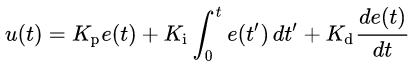

# PID Controller
This repository was created as a submission for the PID Controller project of Udacity's Self Driving Car Nanodegree. The goal of the PID Controller project was to create a PID controller in C++ and test it against Udacity's simulator.


## Overview
The main objective of this project was to create a C++ program which communicates with a driving simulator, sending the current steering angle based on the distance of the vehicle from the center of the road. The project was completed by implementing and tuning a PID controller as described below.


## Inputs

The input from the simulator to the pid controller is the cross-track error (CTE), which is the distance of the vehicle from the center of the road.


## Outputs

The PID controller's output to the simulator is the steering angle which is calculated and sent every timestep.


## Implementation of the PID controller

### PID controllers

A PID controller is a control loop mechanism which continuously calculates an error value as the difference between a desired setpoint (here: the center of the road) and a measured process variable (here: the distance from the center of the road) and applies a correction based on proportional, integral, and derivative terms (denoted P, I, and D respectively).

The controller is easily visualized in the following block diagram and the equation below may be used to calculate the total error:




Here Kp, Ki and Kd denote the coefficients for the proportional, integral, and derivative terms respectively.

### Summary of PID code

The PID controller is implemented mainly in the ```PID``` class (in ```PID.cpp```), which contains the following functions:
- ```Init()```: sets the controller's initial coefficients and sets all error values to zero
- ```UpdateError()```: updates the P, I and D errors based on the current CTE
- ```TotalError()```: calculates the total error based on the coefficients and error values
- ```AverageError()```, ```MinError()```, ```MaxError()```: useful information for tuning the controller and debugging

A PID object is instantiated in ```main.cpp``` and used to calculate the current steering angle based on the distance of the vehicle from the center of the road. Communication with the simulator is handled by a WebSocket, implemented using [uWebSockets](https://github.com/uNetworking/uWebSockets).


### Tuning the controller

Parameters were tuned using the "Twiddle" algorithm showed in the Udacity course and implemented in ```main.cpp```. This algorithm involves systematically changing the coefficients one by one, adding or subtracting smaller and smaller amounts until a certain threshoild is reached. I ran the algorithm for 750 timesteps (about a lap) for each set of parameters, until I finally reached the final set of coefficents:

**Kp**: 0.229981
**Ki**: 0.000849273
**Kd**: 1.70926


### Effect of the P, I, D components

The effects of the individual components were clearly visible when trying to manually tune the controller:

- The P component is a good first step in trying to keep on the road, but it is hard to stabilize because it either overshoots or does not add enough control.
- The I component serves to eliminate any bias (e.g. offset in the steering angle) that may be present in the system causing the vehicle's position to be offset from the desired value. The simulator probably doesn't have any such biases, but the I component still helps in stabilizing the vehicle.
- The D component can help in eliminating the overshooting effect of the P component: when tuned properly, a PD controller will approach the intended value smoothly.


## Running the code

The repo is configured to start up by running the default build task in VS Code if the simulator is installed in the same directory. It can also be manually run using the following commands from the project's top directory:

1. ```mkdir build && cd build```
2. ```cmake .. && make```
3. ```./pid```,

which will run the pid controller. To download and run the simulator, see: [Udacity Simulator](https://github.com/udacity/self-driving-car-sim/releases)


## Pass criteria for the project

The main requirement for this project was to achieve that the vehicle can successfully drive a lap around the track in the simulator without leaving the driveable surface of the road.

## Results and Summary

The PID controller code itself was very easy to write. However, tuning the controller was a big challenge and my current coefficients are probably just a local minimum of all possible parameter sets. Nevertheless the car is able to complete a lap without driving off the road. The controller could probably be improved by using different tuning methods, e.g. the Ziegler–Nichols method.

